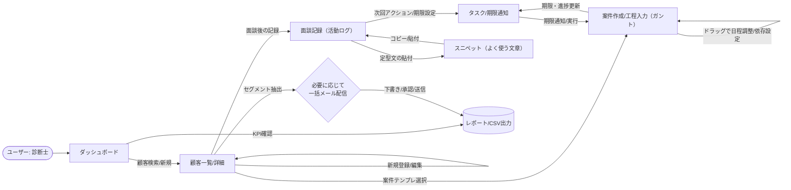
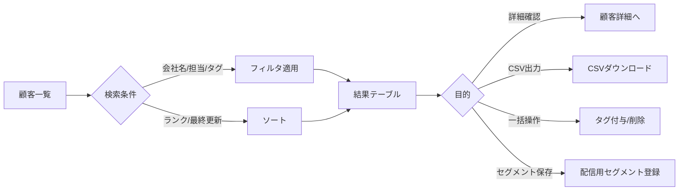
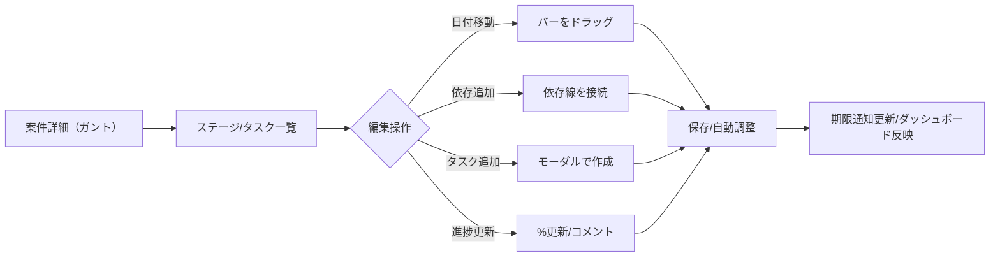
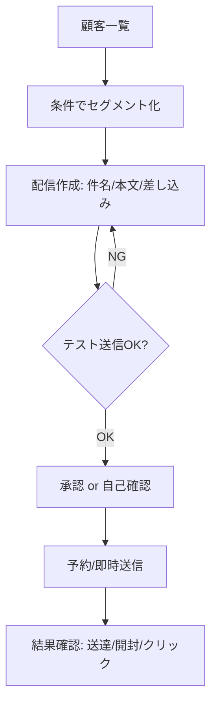

##要件定義書###

# ENLINK 要件定義書（コア機能版・非技術）

最終更新：2025-10-14

> 本書は、**目的と必須コア機能**に絞った非技術版の要件定義書です（単独利用の中小企業診断士を想定）。

---

## 1. 目的（ゴール）

* 面談〜提案〜実行支援までの**情報を一元化**し、漏れや重複を防ぐ。
* 顧客対応の**正確性とスピード**を向上させる。
* 案件の工程（期日・依存）を**視覚的に把握**し、滞留を回避する。
* 日次の「次にやるべきこと」を**明確化**し、確実に前進させる。

## 2. 対象ユーザー

* **診断士（単独利用）**：自分の顧客管理・面談記録・案件工程管理・一括配信（任意）を行う。

## 3. スコープ（インスコープのみ）

* 顧客管理（**一覧/詳細**、検索/フィルタ、タグ、基本属性、重複抑止）
* 面談記録（活動ログ：要点、次回アクション、期日、添付）
* 案件・工程管理（**ガント**：タスク、期日、依存、進捗、テンプレ）
* タスク/通知（期日/次アクションの可視化・リマインド）
* ダッシュボード（今日の対応、期限間近、案件の滞留）
* CSV入出力（顧客・活動・案件の**インポート/エクスポート**）
* 「**よく使う文章**」スニペット（保存・分類・検索・コピー）
* （任意）一括メール配信：顧客一覧からセグメント→下書き→送信（外部サービス連携を想定）

## 4. 利用シナリオ（最小フロー）

1. 面談後、顧客を**新規登録**または既存顧客を**検索**して開く。
2. **面談記録**を作成：要点、次回アクション、期日、必要な添付を登録。
3. 案件が必要であればテンプレから**工程（ガント）**を作成し、日程を調整。
4. **ダッシュボード**で「今日やること」を確認し、期限前通知に従って実行。
5. 定期対応や連絡文は「**よく使う文章**」からコピーして活用。

## 5. 画面/機能要件（概要）

### 5.1 顧客一覧/詳細

* 一覧：主要列（会社名/担当者/業種/所在地/メール/ランク/タグ/最終更新/案件数/次回アクション日）
* 検索・フィルタ：会社名、担当者、タグ、ランク、期間、更新順
* 詳細：基本情報、活動履歴、関連案件（リンク表示）

### 5.2 面談記録（活動ログ）

* 入力項目：件名/要点（自由記述）/次回アクション/期日/添付/メモ
* 記録の一覧と並び替え（新しい順）
* 記録からタスク化/案件作成のショートカット

### 5.3 案件・工程（ガント）

* 案件単位にステージ/タスクを保持、**ドラッグで日程調整**
* 依存関係、進捗%、コメント
* テンプレ：標準WBS（例：診断→計画→申請→実行支援→フォロー）

### 5.4 タスク/通知

* 個人タスク（期限、重要度、関連顧客/案件）
* 期限前通知（例：3日前/当日）
* ダッシュボードに「期限切れ/今日/今週」を整理表示

### 5.5 ダッシュボード

* 今日のアクション、期限間近、未完了タスク、案件ステージの分布
* 直近の活動ログ、最近更新した顧客

### 5.6 CSV入出力

* インポート：テンプレCSVに準拠。重複検出→マージ支援
* エクスポート：顧客/活動/案件/タスク単位

### 5.7 よく使う文章（スニペット）

* 項目：タイトル、カテゴリ、タグ、本文（テキスト/Markdown可）、ショートコード、使用回数
* 操作：保存/検索/コピー（面談記録画面から呼び出し）

### 5.8 一括メール配信（任意）

* セグメント作成（一覧の検索条件から保存）
* 下書き作成（件名/本文/差し込み：社名・担当名）
* テスト送信→送信（予約可）
* 結果確認（送達/開封/クリックが取れる範囲で）

## 6. データ項目（概要）

* 顧客：会社名/屋号、業種、所在地（都道府県/市区）、担当者名、メール、電話、ランク、タグ、同意区分、最終更新日
* 記録：対象顧客、件名、要点、次回アクション、期日、添付、作成日
* 案件：対象顧客、名称、ステージ/タスク、開始/期限、依存、進捗%、コメント
* スニペット：タイトル、カテゴリ、タグ、本文、ショートコード、更新日、使用回数

## 7. 成功指標（KPI）

* 対応漏れ件数/月（目標：0）
* 「要点＋次回アクション」付き記録の件数/月（増加）
* 面談〜提案の平均リードタイム（短縮）
* 期限超過タスク率（低下）

## 8. 受入基準（抜粋）

* 顧客の**登録/検索/一覧表示**が意図通りに機能し、主要列でソート/フィルタが可能
* 面談記録の作成・閲覧・編集が可能、**次回アクション/期日**が保存される
* 案件のガントで、タスクの**作成/日程移動/依存設定/進捗更新**が行える
* ダッシュボードで**今日・期限切れ**のタスクが正しく表示される
* CSVインポートでテンプレに従ったデータが取り込まれ、重複時は**マージ支援**が提示される
* スニペットが保存・検索でき、記録画面で**コピー**して貼り付け可能

## 9. 段階的リリース（非技術・機能観点）

* **Phase 1（MVP）**：顧客/記録/ダッシュボード/CSV（顧客）/ガント最小/スニペット最小/通知
* **Phase 2**：ガント強化（依存/テンプレ拡張）、CSV全体、一覧の一括操作、セグメント保存
* **Phase 3（任意）**：一括メール配信、簡易レポート、追加のKPIビュー

---

> 付記：本書は機能観点に限定しています。画面仕様、項目定義（文言/バリデーション）、運用ルール（命名、タグ設計、記録粒度）を次フェーズで確定してください。


##ユーザーフロー図##

# ENLINK ユーザーフロー図（初版）

最終更新：2025-10-14

> 前提：単独利用の中小企業診断士。面談後の**手動入力→記録→工程（ガント）**が主軸。付随して一覧・検索、スニペット活用、一括配信（任意）を含む。

---

## 1) 全体フロー（ハイレベル）



---

## 2) 顧客登録〜面談記録〜工程入力（メイン導線）

```mermaid
flowchart TD
  A[面談終了] --> B{顧客は既存?}
  B -- 既存 --> C[顧客詳細を開く]
  B -- 新規 --> D[顧客新規登録\n(会社名/業種/担当/連絡/同意/タグ)] --> C
  C --> E[面談記録を新規作成\n(要点/次回アクション/期日/添付)]
  E --> F{案件が必要?}
  F -- Yes --> G[案件テンプレを選択]
  G --> H[ガント自動生成\n(ステージ/タスク/依存)]
  H --> I[日程微調整\n(ドラッグ&ドロップ)]
  I --> J[通知設定\n(期限3日前など)]
  F -- No --> K[記録保存のみ]
  J --> L[ダッシュボードへ\n（次アクション表示）]
  K --> L
```

---

## 3) 顧客一覧の利用フロー（検索・フィルタ・CSV）



---

## 4) スニペット（よく使う文章）の作成〜利用

```mermaid
flowchart TD
  A[スニペット一覧] --> B{新規 or 既存編集}
  B -->|新規| C[タイトル/カテゴリ/タグ/本文(MD)/ショートコード]
  B -->|既存| D[本文修正/タグ更新]
  C --> E[保存]
  D --> E
  E --> F[面談記録画面で呼び出し]
  F --> G[コピー/貼付]
  G --> H[必要に応じ整形して保存]
```

---

## 5) 案件（ガント）編集フロー



---

## 6) 一括メール配信（任意）



---

## 7) エラー/例外系の基本ハンドリング

* 重複顧客検出 → マージ提案（フィールド毎に採用選択）
* 入力不足（必須） → セクション内にインラインエラー表示
* 同意なしの配信対象 → 自動除外 + 理由表示
* 期限衝突（依存関係逆転） → 自動再計算 or 確認ダイアログ

---

### 付記：次ステップ

* この図に沿って**各画面のワイヤーフレーム**を作成（ダッシュボード／顧客一覧／顧客詳細／面談記録／ガント／スニペット）。
* 矢印（導線）に対応する**UIコンポーネント**を洗い出し、実装順にチケット化。
